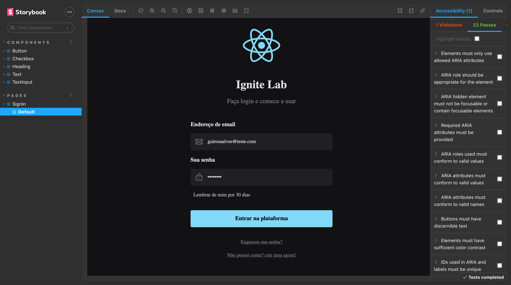

<!-- Improved compatibility of back to top link: See: https://github.com/othneildrew/Best-README-Template/pull/73 -->
<a name="readme-top"></a>
<!--
*** Thanks for checking out the Best-README-Template. If you have a suggestion
*** that would make this better, please fork the repo and create a pull request
*** or simply open an issue with the tag "enhancement".
*** Don't forget to give the project a star!
*** Thanks again! Now go create something AMAZING! :D
-->


<!-- PROJECT SHIELDS -->
<!--
*** I'm using markdown "reference style" links for readability.
*** Reference links are enclosed in brackets [ ] instead of parentheses ( ).
*** See the bottom of this document for the declaration of the reference variables
*** for contributors-url, forks-url, etc. This is an optional, concise syntax you may use.
*** https://www.markdownguide.org/basic-syntax/#reference-style-links
-->
<div align="center">

[![Last Commit][last-commit-shield]][last-commit-url]
[![Issues][issues-shield]][issues-url]
[![Project Language][project-language-shield]][project-language-url]
[![Deployed Status][deployed-status-shield]][deployed-status-url]
[![MIT License][license-shield]][license-url]
[![LinkedIn][linkedin-shield]][linkedin-url]

</div>

<!-- PROJECT LOGO -->
<br />
<div align="center">
  <!--  -->

  <h3 align="center">Design System</h3>

<p align="center">
Projeto Frontend completo, feito desde o FIGMA até publicação.
<br />
<br />
    
<a href="https://guirosaalves.github.io/ignitelab-design-system/?path=/story/pages-signin--default">
  
</a>
<a href="https://www.figma.com/file/H2Xz29eLqDyeuMcrBNi9o7/Ignite-Lab-Design-System?node-id=0%3A1&t=NsrqCtKa01pfq5jF-1">
  
</a>
<br />
<a href="https://github.com/GuiRosaAlves/ignitelab-design-system/issues">
  
</a>
<a href="https://github.com/GuiRosaAlves/ignitelab-design-system/issues">
  
</a>
</p>
</div>


<!-- TABLE OF CONTENTS -->
<details>
  <summary>Índice</summary>
  <ol>
    <li>
      <a href="#sobre-o-projeto">Sobre o Projeto</a>
      <ul>
        <li><a href="#tecnologias">Tecnologias</a></li>
      </ul>
    </li>
    <li>
      <a href="#executando-o-projeto">Executando o projeto</a>
      <ul>
        <li><a href="#requisitos">Requisitos</a></li>
        <li><a href="#configurações-iniciais">Configurações iniciais</a></li>
      </ul>
    </li>
    <li><a href="#contribuições">Contribuições</a></li>
        <li><a href="#licença">Licença</a></li>
    <li><a href="#contato">Contato</a></li>
    <li><a href="#autores-e-reconhecimento">Autores e reconhecimento</a></li>
  </ol>
</details>


<!-- SOBRE O PROJETO -->
## Sobre o Projeto



Aplicacao Frontend desenvolvida junto com a RocketSeat usando React, Storybook, Figma e testes unitarios.

<p align="right">(<a href="#readme-top">voltar para o começo</a>)</p>


### Tecnologias

* [![React][React.js]][React-url]
* [![Tailwind][tailwind-css-shield]][tailwind-css-url]
* [![Vite][vite-shield]][vite-url]
* [![Typescript][typescript-shield]][typescript-url]
* [![Storybook][storybook-shield]][storybook-url]
* [![Figma][figma-shield]][figma-url]

<p align="right">(<a href="#readme-top">voltar para o começo</a>)</p>

<!-- EXECUTANDO O PROJETO -->
## Executando o projeto

### Requisitos

Primeiramente instale Node Package Manager.
Para executar esse projeto voce precisa usar uma versao do node <= 16.19.0.
* node
  ```sh
  npm install npm@16.19.0 -g
  ```
Para uma melhor experiencia, e recomendado o uso do gerenciador de pacotes yarn
* yarn
  ```sh
  npm i -g corepack
  ```

### Configurações iniciais

_Exemplo de como configurar e rodar a aplicacao._

1. Clone o repositorio
   ```sh
   git clone https://github.com/GuiRosaAlves/ignitelab-design-system.git
   ```
   
<br />

2. Instale as dependencias
* comando NPM
   ```sh
   npm install
   ```
* comando Yarn
   ```sh
   yarn
   ```
   
<br />

3. Abra o Storybook
* comando NPM
   ```sh
   npm run storybook
   ```
* comando Yarn
   ```sh
   yarn storybook
   ```
   
<br />

4. Rode o projeto
* comando NPM
   ```sh
   npm run dev
   ```
* comando Yarn
   ```sh
   yarn dev
   ```
   
<br />

<p align="right">(<a href="#readme-top">voltar para o começo</a>)</p>

<!-- CONTRIBUIÇOES -->
## Contribuições

Contribuicoes sao oque tornam a comunidade open source um otimo lugar para estudar, inspirar e criar. Qualquer contribuicao e muito bem vinda.

Se voce possui uma sugestao de melhoria, criar um fork e faca um pull request. Voce tambem pode criar uma reclamacao com a tag "melhoria".

1. Crie um fork do projeto
2. Crie uma feature branch (`git checkout -b feature/NewFeature`)
3. Commit as alteracoes (`git commit -m 'Added NewFeature'`)
4. De Push para a branch criada (`git push origin feature/NewFeature`)
5. Crie um Pull Request

<p align="right">(<a href="#readme-top">voltar para o começo</a>)</p>


<!-- LICENÇA -->
## Licença

Projeto publicado em 2022 sobre a licença MIT ❤️

<p align="right">(<a href="#readme-top">voltar para o começo</a>)</p>


<!-- CONTATO -->
## Contato

Guilherme Rosa Alves - [@meu_linkedin](https://www.linkedin.com/in/guirosaalves/) - guilhermerosaalves@gmail.com

Link do projeto: [https://guirosaalves.github.io/ignitelab-design-system/](https://guirosaalves.github.io/ignitelab-design-system/?path=/story/pages-signin--default)

<p align="right">(<a href="#readme-top">voltar para o começo</a>)</p>


<!-- AUTORES E RECONHECIMENTO -->
## Autores e reconhecimento

* [Rocket Seat](https://www.rocketseat.com.br/)
* [Post Css](https://postcss.org/)
* [Radix UI](https://www.radix-ui.com/)
* [CLSX](https://github.com/lukeed/clsx)
* [Phospor Icons](https://github.com/phosphor-icons/phosphor-react)
* [Jest](https://jestjs.io/)
* [Axios](https://axios-http.com/)
* [MSW](https://mswjs.io/)

<p align="right">(<a href="#readme-top">voltar para o começo</a>)</p>


<!-- MARKDOWN LINKS & IMAGES -->
<!-- https://www.markdownguide.org/basic-syntax/#reference-style-links -->

[contributors-shield]: https://img.shields.io/github/contributors/othneildrew/Best-README-Template.svg?style=for-the-badge
[contributors-url]: https://github.com/othneildrew/Best-README-Template/graphs/contributors
[forks-shield]: https://img.shields.io/github/forks/othneildrew/Best-README-Template.svg?style=for-the-badge
[forks-url]: https://github.com/othneildrew/Best-README-Template/network/members
[stars-shield]: https://img.shields.io/github/stars/othneildrew/Best-README-Template.svg?style=for-the-badge
[stars-url]: https://github.com/othneildrew/Best-README-Template/stargazers
[issues-shield]: https://img.shields.io/github/issues/GuiRosaAlves/ignitelab-design-system.svg?style=for-the-badge
[issues-url]: https://github.com/GuiRosaAlves/ignitelab-design-system/issues
[license-shield]: https://img.shields.io/github/license/othneildrew/Best-README-Template.svg?style=for-the-badge
[license-url]: https://github.com/GuiRosaAlves/ignitelab-design-system/blob/master/LICENSE.txt
[linkedin-shield]: https://img.shields.io/badge/-LinkedIn-black.svg?style=for-the-badge&logo=linkedin&colorB=555
[linkedin-url]: https://www.linkedin.com/in/guirosaalves/
[product-screenshot]: images/screenshot.png
[Next.js]: https://img.shields.io/badge/next.js-000000?style=for-the-badge&logo=nextdotjs&logoColor=white
[Next-url]: https://nextjs.org/
[React.js]: https://img.shields.io/badge/React-20232A?style=for-the-badge&logo=react&logoColor=61DAFB
[React-url]: https://reactjs.org/
[Vue.js]: https://img.shields.io/badge/Vue.js-35495E?style=for-the-badge&logo=vuedotjs&logoColor=4FC08D
[Vue-url]: https://vuejs.org/
[Angular.io]: https://img.shields.io/badge/Angular-DD0031?style=for-the-badge&logo=angular&logoColor=white
[Angular-url]: https://angular.io/
[Svelte.dev]: https://img.shields.io/badge/Svelte-4A4A55?style=for-the-badge&logo=svelte&logoColor=FF3E00
[Svelte-url]: https://svelte.dev/
[Laravel.com]: https://img.shields.io/badge/Laravel-FF2D20?style=for-the-badge&logo=laravel&logoColor=white
[Laravel-url]: https://laravel.com
[Bootstrap.com]: https://img.shields.io/badge/Bootstrap-563D7C?style=for-the-badge&logo=bootstrap&logoColor=white
[Bootstrap-url]: https://getbootstrap.com
[JQuery.com]: https://img.shields.io/badge/jQuery-0769AD?style=for-the-badge&logo=jquery&logoColor=white
[JQuery-url]: https://jquery.com
[last-commit-shield]: https://img.shields.io/github/last-commit/GuiRosaAlves/ignitelab-design-system?style=for-the-badge
[last-commit-url]: https://github.com/GuiRosaAlves/ignitelab-design-system/commits
[project-language-shield]: https://img.shields.io/github/languages/top/GuiRosaAlves/ignitelab-design-system?style=for-the-badge
[project-language-url]: https://github.com/GuiRosaAlves
[deployed-status-shield]: https://img.shields.io/github/deployments/GuiRosaAlves/ignitelab-design-system/github-pages?style=for-the-badge
[deployed-status-url]: https://guirosaalves.github.io/ignitelab-design-system/
[checkout-shield]: https://img.shields.io/badge/-Explore%20a%20Documentação-FF4785?style=for-the-badge&logo=storybook&logoColor=white
[checkout-url]: https://guirosaalves.github.io/ignitelab-design-system/?path=/story/pages-signin--default
[bug-report-shield]: https://img.shields.io/badge/-Reportar%20Bug-critical?style=for-the-badge
[bug-report-url]: https://github.com/GuiRosaAlves/ignitelab-design-system/issues
[feature-request-shield]: https://img.shields.io/badge/-Requisitar%20Feature-informational?style=for-the-badge
[feature-request-url]: https://github.com/GuiRosaAlves/ignitelab-design-system/issues
[tailwind-css-shield]: https://img.shields.io/badge/tailwindcss-%2338B2AC.svg?style=for-the-badge&logo=tailwind-css&logoColor=white
[tailwind-css-url]: https://tailwindcss.com/
[post-css-shield]: https://img.shields.io/badge/-Post%20Css-red?style=for-the-badge&logo=post-css&logoColor=white
[post-css-url]: https://postcss.org/
[vite-shield]: https://img.shields.io/badge/vite-%23646CFF.svg?style=for-the-badge&logo=vite&logoColor=white
[vite-url]: https://vitejs.dev/
[typescript-shield]: https://img.shields.io/badge/typescript-%23007ACC.svg?style=for-the-badge&logo=typescript&logoColor=white
[typescript-url]: https://www.typescriptlang.org/
[radix-ui-shield]: https://img.shields.io/badge/-Radix--UI-blueviolet?style=for-the-badge&logo=radix-ui&logoColor=white
[radix-ui-url]: https://www.radix-ui.com/
[storybook-shield]: https://img.shields.io/badge/-Storybook-FF4785?style=for-the-badge&logo=storybook&logoColor=white
[storybook-url]: https://storybook.js.org/
[clsx-shield]: https://img.shields.io/badge/-CLSX-lightgrey?style=for-the-badge
[clsx-url]: https://github.com/lukeed/clsx
[phospor-icons-shield]: https://img.shields.io/badge/-phospor--icons-yellow?style=for-the-badge
[phospor-icons-url]: https://github.com/phosphor-icons/phosphor-react
[figma-shield]: https://img.shields.io/badge/figma-%23F24E1E.svg?style=for-the-badge&logo=figma&logoColor=white
[figma-url]: https://www.figma.com/file/H2Xz29eLqDyeuMcrBNi9o7/Ignite-Lab-Design-System?node-id=0%3A1&t=NsrqCtKa01pfq5jF-1
[jest-shield]: https://img.shields.io/badge/-jest-%23C21325?style=for-the-badge&logo=jest&logoColor=white
[jest-url]: https://jestjs.io/
[axios-shield]: https://img.shields.io/badge/-Axios-blueviolet?style=for-the-badge
[axios-url]: https://axios-http.com/
[msw-shield]: https://img.shields.io/badge/MSW-orange?style=for-the-badge
[msw-url]: https://mswjs.io/
